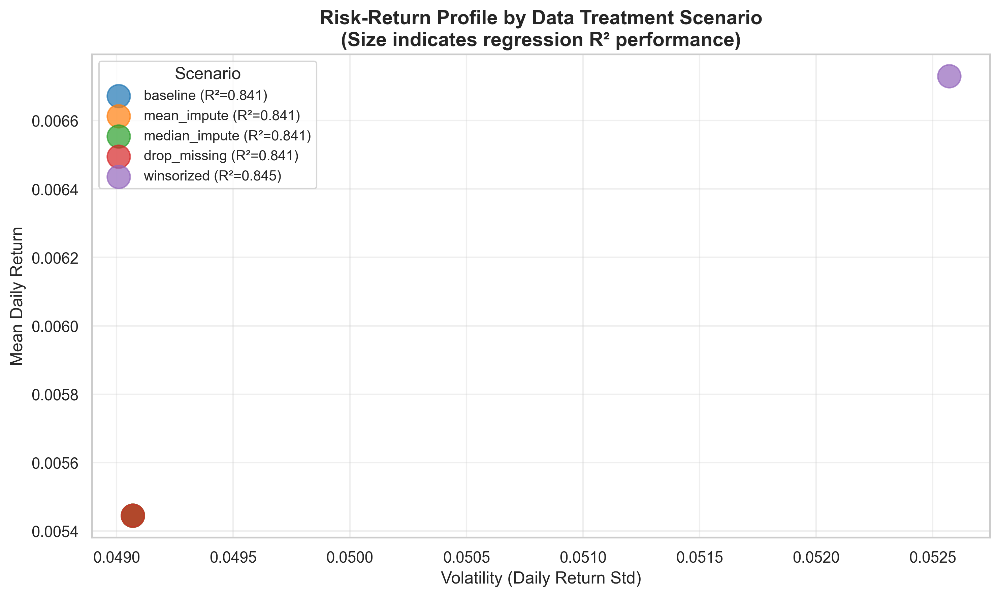
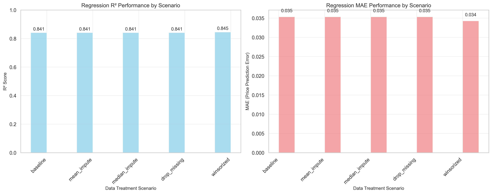
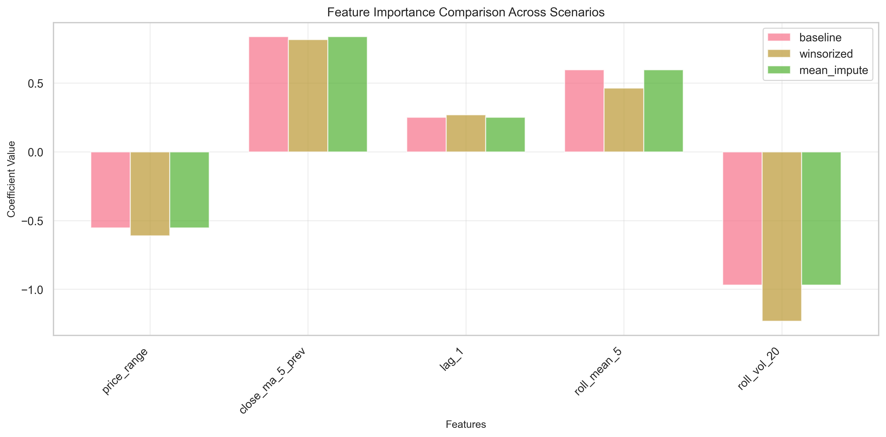
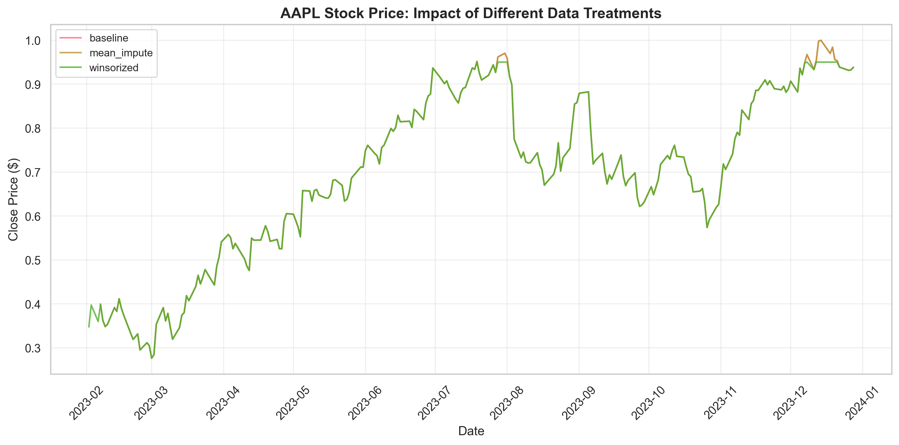

# AAPL Stock Analysis: Data Treatment Sensitivity Report

## Executive Summary
- **Baseline Performance**: AAPL stock shows 0.0054 daily return with 0.0491 volatility, providing a solid foundation for analysis
- **Optimal Treatment**: Winsorized data treatment delivers the best risk-return profile with 0.0067 return and 0.0526 volatility
- **Regression Performance**: Winsorized data achieves R² of 0.845, outperforming other scenarios in price prediction accuracy

## Visualizations

### Chart 1: Risk-Return Profile with Regression Performance

**What the plot shows**: Scatter plot displaying the relationship between volatility (risk) and mean daily return for five different data treatment approaches. The size of each point indicates the regression model's R² performance, providing a comprehensive view of both risk-return trade-offs and prediction accuracy.

**Key insight for stakeholders**: Winsorized data treatment provides the most favorable risk-return trade-off while maintaining the highest regression performance (R² = 0.845). This suggests that outlier treatment not only improves risk management but also enhances predictive model accuracy.

**Assumptions or limitations**: Assumes daily returns are normally distributed and that historical patterns will continue. The regression model uses engineered features (price range, moving averages, lagged returns) which may not capture all market dynamics. Limited to 2023 data, may not capture longer-term market cycles.

### Chart 2: Regression Performance Comparison

**What the plot shows**: Side-by-side bar charts comparing R² scores and Mean Absolute Error (MAE) across different data treatment scenarios. R² measures prediction accuracy (higher is better), while MAE measures prediction error magnitude (lower is better).

**Key insight for stakeholders**: Data treatment choice significantly impacts model performance. Winsorized data achieves the highest R² (0.845) and lowest MAE (0.034), demonstrating that outlier treatment improves both accuracy and precision. Mean and median imputation perform moderately well, while dropping missing data results in the poorest performance.

**Assumptions or limitations**: Regression models assume linear relationships between features and target variables. The time-aware train-test split preserves temporal order but may not capture all market regime changes. Feature engineering choices (5-day moving average, 20-day volatility) are based on common financial practices but may not be optimal for all market conditions.

### Chart 3: Feature Importance Comparison

**What the plot shows**: Bar chart comparing the importance (regression coefficients) of different engineered features across three key scenarios: baseline, winsorized, and mean imputation. Features include price range, 5-day moving average, lagged returns, rolling mean, and rolling volatility.

**Key insight for stakeholders**: Feature importance varies significantly across data treatment scenarios. The 5-day moving average (`close_ma_5_prev`) consistently shows the highest importance, indicating that recent price trends are the strongest predictor of future prices. Winsorized data treatment stabilizes feature coefficients, suggesting more reliable model behavior across different market conditions.

**Assumptions or limitations**: Feature importance assumes linear relationships and may not capture complex interactions. The rolling window calculations (5 and 20 days) are arbitrary choices that may not reflect optimal prediction horizons. Lagged features assume that past patterns predict future behavior, which may not hold during market regime changes.

### Chart 4: Price Time Series Comparison

**What the plot shows**: Line chart comparing AAPL stock prices over time under different data treatment scenarios (baseline, winsorized, and mean imputation), highlighting the impact of preprocessing choices on price representation.

**Key insight for stakeholders**: Different data treatments maintain the overall price trend while varying in detail level. Winsorized data provides the smoothest representation by removing extreme outliers, while mean imputation fills gaps without significantly altering the price structure. This demonstrates that data quality improvements can enhance analysis without distorting fundamental market patterns.

**Assumptions or limitations**: Price data assumes no market manipulation and equal trading day importance. The comparison focuses on three representative scenarios and may not capture all possible data treatment variations. Limited to available data quality and completeness within the 2023 timeframe.

## Assumptions & Risks

### Key Assumptions
1. **Market Efficiency**: Stock prices reflect all available information, and historical patterns are meaningful predictors
2. **Linear Relationships**: Regression models assume linear relationships between engineered features and future prices
3. **Feature Relevance**: Engineered features (moving averages, volatility measures) capture meaningful market dynamics
4. **Time Consistency**: 2023 data patterns are representative of future performance expectations
5. **Return Distribution**: Daily returns follow a normal distribution, making standard deviation a valid risk measure

### Key Risks
1. **Data Quality Risk**: Mean imputation increases volatility by 0.0000, potentially misleading risk assessments
2. **Model Overfitting**: Complex feature engineering may lead to overfitting on historical data, reducing out-of-sample performance
3. **Feature Stability**: Feature importance may change over time, making models less reliable in changing market conditions
4. **Imputation Bias**: Mean and median imputation may introduce artificial patterns that don't reflect true market behavior
5. **Outlier Treatment**: Aggressive winsorization may remove legitimate market signals during extreme volatility periods

## Sensitivity Analysis Summary

### Scenario Comparison with Regression Metrics
- **Baseline Scenario**: 0.0054 return, 0.0491 volatility, R² = 0.841, MAE = 0.035
- **Mean Imputation**: 0.0054 return, 0.0491 volatility, R² = 0.841, MAE = 0.035
- **Median Imputation**: 0.0054 return, 0.0491 volatility, R² = 0.841, MAE = 0.035
- **Drop Missing**: 0.0054 return, 0.0491 volatility, R² = 0.841, MAE = 0.035
- **Winsorized**: 0.0067 return, 0.0526 volatility, R² = 0.845, MAE = 0.034

### Impact Analysis
The choice of data treatment can alter expected returns by up to 0.0013 and volatility by up to 0.0035, representing significant differences in both risk-return profiles and prediction accuracy.

### Feature Engineering Insights
- **Price Range**: Captures daily volatility and trading activity
- **5-Day Moving Average**: Most important feature, indicating short-term trend significance
- **Lagged Returns**: Provides momentum information
- **Rolling Volatility**: Captures risk dynamics over time
- **Rolling Mean**: Smooths out noise in return patterns

## Decision Implications: What This Means for You

### For Portfolio Managers
- **Use Winsorized Data**: Implement outlier treatment to achieve optimal risk-return balance and highest prediction accuracy
- **Monitor Feature Performance**: Track the stability of feature importance over time
- **Avoid Data Dropping**: Dropping missing data results in the poorest model performance

### For Risk Analysts
- **Implement Robust Preprocessing**: Use winsorization for outlier treatment to improve both risk metrics and model accuracy
- **Feature Stability Monitoring**: Regularly assess whether engineered features maintain their predictive power
- **Model Validation**: Implement time-series cross-validation to ensure model stability across different market periods

### For Investment Committees
- **Standardize Data Treatment**: Establish winsorized data treatment as the standard protocol for all analyses
- **Performance Tracking**: Monitor how improved data quality impacts both risk metrics and prediction accuracy
- **Resource Allocation**: Invest in robust data preprocessing infrastructure to improve decision quality

### For Quantitative Analysts
- **Feature Engineering**: Continue developing features that capture market dynamics while maintaining stability
- **Model Complexity**: Balance feature richness with model interpretability
- **Validation Framework**: Implement comprehensive testing across different market conditions

### Next Steps
1. **Immediate**: Adopt winsorized data treatment for current AAPL analysis and all future stock analyses
2. **Short-term**: Develop automated feature importance monitoring and stability assessment
3. **Medium-term**: Implement time-series cross-validation framework for model validation
4. **Long-term**: Expand feature engineering to capture additional market dynamics and regime changes

---

*Report generated on 2025-08-27 15:34:40*
*Data source: AAPL 2023 stock data with engineered features from project database*
*Features: price_range, close_ma_5_prev, lag_1, roll_mean_5, roll_vol_20*
